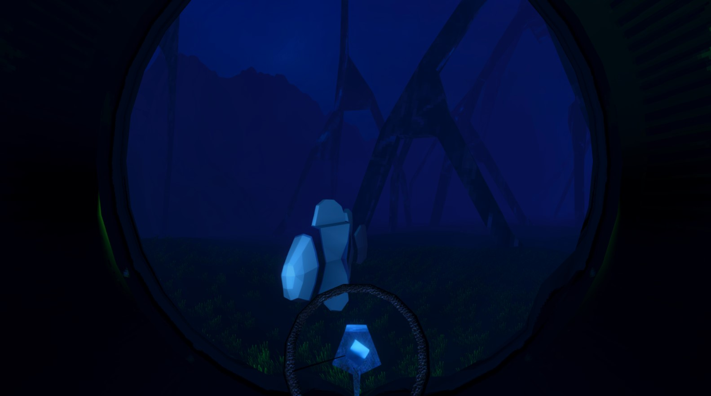
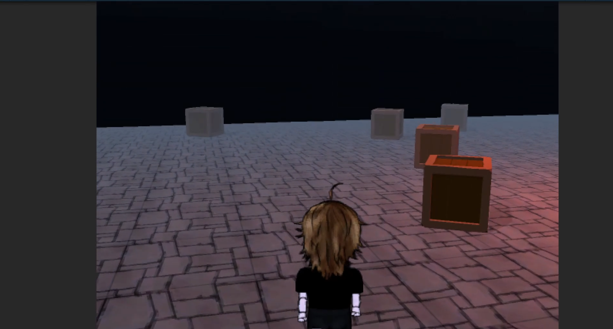

<div align="center">

# 🎮 Erik Oliveira

### Game Programmer • Unity Developer • Gameplay & Systems Programmer


<br>


---

# 👋 Sobre Mim

Sou desenvolvedor focado em **programação de jogos**, com interesse especial em **Unity**, **C#**, **sistemas de gameplay**, **arquitetura de jogos** e criação de ferramentas reutilizáveis para desenvolvimento.

Meu foco está na construção de sistemas que sustentam experiências interativas, como movimentação, interação, inventário, puzzles, save/load, transições de cena, persistência de mundo e estruturas modulares para jogos.

Tenho interesse em aprender, testar e desenvolver diferentes tipos de mecânicas, mundos e experiências digitais, sempre buscando unir programação, organização técnica e sensação de jogo.

<br>

> Meu principal ambiente de desenvolvimento e versionamento é o **GitLab**, onde mantenho grande parte dos meus projetos, protótipos e experimentações em Unity.

<br>

<div align="center">

<a href="https://gitlab.com/erikoliveira091">

</a>

<a href="https://github.com/erikoliveira091">

</a>

</div>

---

# 🌙 Projeto Principal Atual

<div align="center">

## Summer's Last Dawn

### Point-and-Click Adventure Narrativo


</div>

<br>

**Summer's Last Dawn** é meu projeto principal atual: um jogo narrativo do gênero **point-and-click adventure**, focado em investigação, exploração, escolhas, interação com o ambiente e sistemas persistentes.

O projeto é desenvolvido em **Unity** com **C#**, utilizando uma estrutura voltada para modularidade, organização de sistemas e expansão progressiva das mecânicas.

---

## Sistemas em Desenvolvimento

<table>
<tr>
<td width="50%" valign="top">

### 🎮 Gameplay Programming

- Movimentação point-and-click
- Interação contextual
- Cursor dinâmico
- Sistema de inventário
- Uso de itens em objetos
- Combinação de itens
- Estrutura para puzzles
- Exploração por cenário
- Interações com portas e objetos

</td>

<td width="50%" valign="top">

### 🧠 Game Systems

- Save/load persistente
- Persistência entre cenas
- Additive scene loading
- Sistema modular de portas
- Estados compartilhados entre objetos
- Controle de cenas e spawns
- Organização por componentes
- Simulação de perspectiva 2D
- Estrutura reutilizável para novos sistemas

</td>
</tr>
</table>

---

# 🚀 Projetos em Destaque

<table>
<tr>
<td width="50%" align="center" valign="top">

## 🌙 Summer's Last Dawn


<br><br>

**Point-and-Click Adventure Narrativo**

Projeto principal atual focado em investigação, exploração, escolhas narrativas e sistemas interativos.

<br><br>

`Unity` `C#` `URP 2D` `Gameplay Systems`

<br>

<details>
<summary>Ver sistemas desenvolvidos</summary>

<br>

- Movimentação point-and-click  
- Inventário  
- Save/load  
- Interações contextuais  
- Sistema modular de portas  
- Transições entre cenas  
- Persistência de objetos  
- Estrutura para puzzles  
- Narrativa interativa  

</details>

<br>

<a href="https://gitlab.com/erikoliveira091/summers-last-dawn">

</a>

</td>

<td width="50%" align="center" valign="top">

## 🩸 Dead by Demake


<br><br>

**Demake no estilo Atari 2600**

Projeto desenvolvido para o trabalho final da disciplina de matemática aplicada a multimidia, com a proposta de ser um demake no estilo do Atari 2600 de um jogo moderno, no caso Dead by Daylight.

<br><br>

`Unity` `C#` `Demake`

<br>

<details>
<summary>Ver destaques técnicos</summary>

<br>

- A* / Pathfinder
- IA de inimigo
- Maquina de Estados Finitos  
- Tilemap  
- Skill Check  

</details>

<br>

<a href="https://gitlab.com/erikoliveira091/dead-by-demake">

</a>

</td>
</tr>

<tr>
<td width="50%" align="center" valign="top">

## 🌑 Abyss of Roots



<br><br>

**Global Game Jam • Tema: Roots**

Projeto desenvolvido em poucos dias para a **Global Game Jam**, explorando o tema **“raízes”** através de uma experiência focada em mistério, exploração e ambientação atmosférica.

<br><br>

> Um misterioso aglomerado de árvores gigantes foi descoberto no meio do oceano profundo.  
> Um pesquisador embarca em uma jornada em busca de respostas nas profundezas de suas raízes.

<br>

`Unity` `C#` `Game Jam` `Atmospheric Design`

<br>

<details>
<summary>Ver destaques técnicos</summary>

<br>

- Exploração atmosférica  
- Narrativa implícita  
- Ambientação misteriosa  
- Estrutura narrativa experimental  
- Sistemas de interação  
- Desenvolvimento rápido para Game Jam  
- Organização modular  
- Construção visual focada no tema “raízes”  

</details>

<br>

<div align="center">

<a href="https://gitlab.com/erikoliveira091/abyss-of-roots">

</a>

<a href="https://rudyzinho.itch.io/abyss-of-roots">

</a>

</div>

</td>

<td width="50%" align="center" valign="top">

## 🎥 Projeto 2.5D



<br><br>

**Gameplay Prototype • Dungeon Crawler Experimental**

Projeto experimental inspirado em jogos como **The Binding of Isaac**, focado em dungeons procedurais, gameplay top-down e mistura entre personagens/sprites 2D com cenários 3D.

<br><br>

> O projeto foi descontinuado, mas serviu como uma importante etapa de aprendizado em sistemas de renderização híbrida, procedural generation e organização visual para jogos 2.5D.

<br>

`Unity` `C#` `Procedural Generation` `2.5D`

<br>

<details>
<summary>Ver destaques técnicos</summary>

<br>

- Geração procedural de salas  
- Estrutura para dungeon crawler  
- Integração entre arte 2D e cenário 3D  
- Estudos de order layer e sorting  
- Experimentação com rigs e animação  
- Estruturação de gameplay top-down  
- Sistemas experimentais de câmera e perspectiva  
- Organização modular para gameplay  

</details>

<br>

<div align="center">

<a href="https://gitlab.com/erikoliveira091/2.5d">

</a>

</div>

</td>
</tr>
</table>

---

# 🛠️ Tecnologias & Ferramentas

<div align="center">

## Game Development

<p>
  
  
  
  
  
  
</p>

<br>

## Linguagens & Apoio Técnico

<p>
  
  
  
  
  
  
</p>

<br>


</div>

---

# 💻 Foco Técnico

<table>
<tr>
<td align="center" width="33%" valign="top">

## 🎮 Gameplay

Sistemas de interação, movimentação, puzzles, inventário e sensação de jogo.

</td>

<td align="center" width="33%" valign="top">

## 🧱 Arquitetura

Organização modular, componentes reutilizáveis, persistência e estrutura de cenas.

</td>

<td align="center" width="33%" valign="top">

## 🛠️ Ferramentas

Ferramentas para Unity, fluxos de produção, debug visual e sistemas editáveis.

</td>
</tr>
</table>

---

# 🌐 Versionamento & Plataformas

<div align="center">

<table>
<tr>
<td align="center" width="50%" valign="top">

## 🦊 GitLab


<br><br>

Principal ambiente de **desenvolvimento ativo**, versionamento e organização dos meus projetos em Unity.

<br><br>

<a href="https://gitlab.com/erikoliveira091">

</a>

</td>

<td align="center" width="50%" valign="top">

## 🐙 GitHub


<br><br>

Espaço utilizado para **portfólio**, apresentação de projetos e repositórios selecionados.

<br><br>

<a href="https://github.com/rudyzinho">

</a>

</td>
</tr>
</table>

</div>

---

# 🎯 Áreas de Interesse

<div align="center">

```txt
Gameplay Programming
Game Systems
Unity Development
C# for Games
Game Architecture
Unity Tools
Point-and-Click Systems
Inventory Systems
Save/Load Systems
Scene Management
Narrative Systems
Interaction Systems
Puzzle Structures
World Persistence
Game Feel
